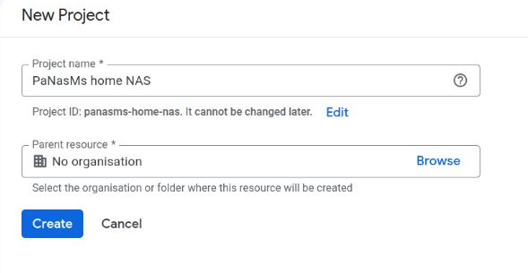
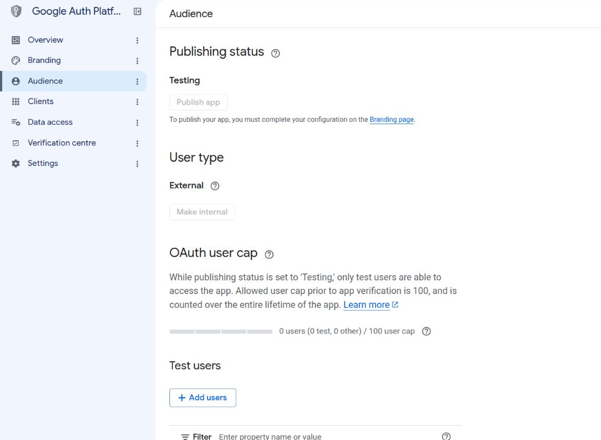
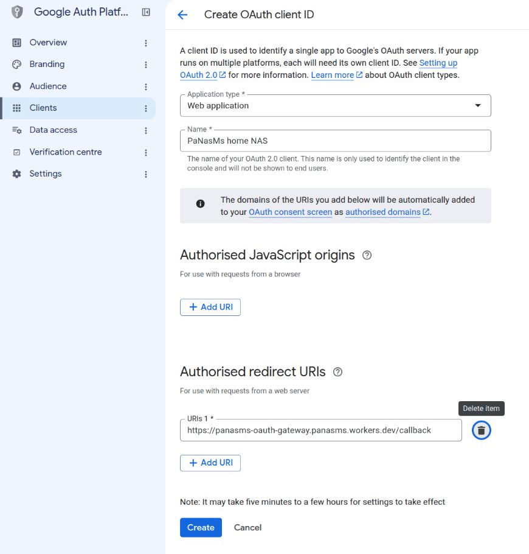
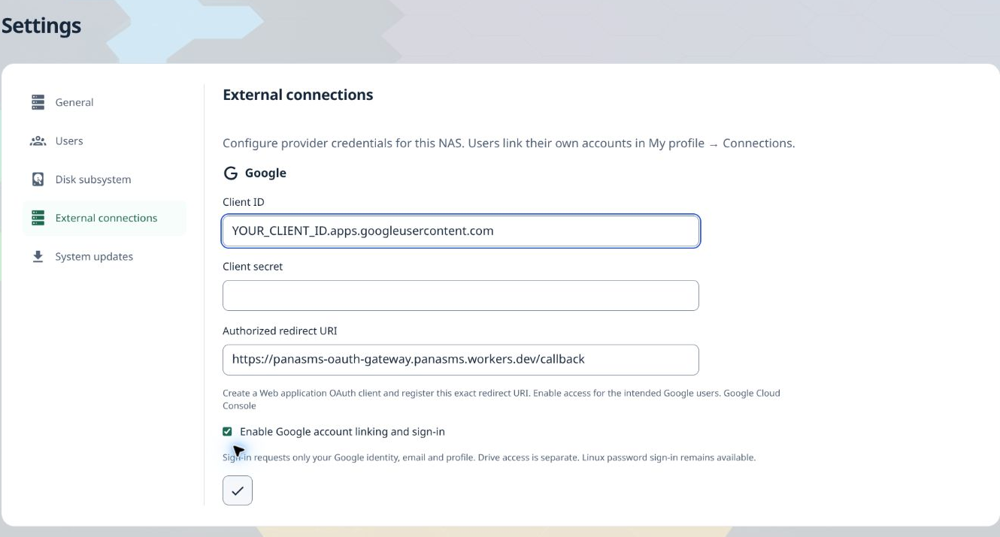
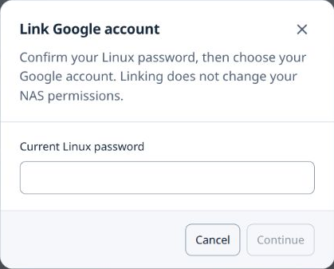

# Set up Google sign-in for your NAS

The maintained [Google integration walkthrough](https://panasms.github.io/docs/setup/google/)
is now on the project website, including the private-network relay and optional
Drive authorization. The original sign-in walkthrough is retained below.

This guide connects Google to **PaNasMs (Pavlo's NAS Management System)**.
You will create a Google client once, save its two credentials on your NAS,
then link a Google account to your existing NAS user.

**Result:** you can use **Sign in with Google** to open your NAS. Your normal
NAS password still works. This does not enable Google Drive or Cloud Sync.

Screenshots use the English interface and were captured on 22 September 2026.
Example forms were not submitted. Google may move or rename controls.

## Before you start

- Have your Google account and your current NAS password ready.
- Sign in to PaNasMs as an administrator to configure the client.
- Your NAS and browser need internet access. You do not need to expose your NAS
  to the internet or forward a router port: the built-in HTTPS callback handles
  Google's response.
- Keep the NAS tab open while working in Google Cloud Console in another tab.

**Already have a Web application client for this NAS?** Check its redirect URI
in [step 4](#4-create-the-google-client), then go to [step 5](#5-save-the-credentials-on-your-nas).
Do not create a replacement client just to link another Google account.

## 1. Create or select a Google project

1. Open [Google Cloud Console](https://console.cloud.google.com/).
2. Sign in with the Google account that will manage the NAS integration.
3. Click the project selector next to the Google Cloud logo, then **New project**.
4. Enter a name such as **PaNasMs home NAS**. The automatically suggested
   **Project ID** can stay as it is; yours may differ from the screenshot.
5. For a personal account, leave **Parent resource** as **No organisation**.
   A work account may require an organisation selected by your administrator.
6. Click **Create**, wait for creation, and select the new project in the header.



You can also use an existing project that you manage. No virtual machine,
storage bucket or Drive API is needed for this sign-in setup.

## 2. Tell Google what your app is

Open [Google Auth Platform](https://console.cloud.google.com/auth/overview)
and check that the correct project is selected at the top.

If you see **Get started**, click it and complete the short wizard:

| Screen | What to enter |
| --- | --- |
| App information | **App name:** `PaNasMs home NAS`. **User support email:** your email. |
| Audience | Choose **External** for personal Google accounts, or a mixture of personal and work accounts. |
| Contact information | An email address you check. |
| Finish | Read Google's policy; if you agree, accept it, then **Continue → Create**. |

If the app is already configured, the same settings are under **Branding** and
**Audience** in the left menu. A logo and public website are not needed for this
personal testing setup. Do not invent website or domain ownership details.

See [Google's consent setup instructions](https://developers.google.com/workspace/guides/configure-oauth-consent)
if your console shows a different setup wizard.

## 3. Check the audience

In the left menu, open **Audience**. For this guide, leave:

- **User type:** External.
- **Publishing status:** Testing.



You do **not** need to press **Publish app** to use this setup at home.
The empty test-user list in this screenshot is intentional: PaNasMs sign-in asks
only for your identity, email and profile. Google exempts these permissions from
the testing user-list requirement and seven-day authorization expiry.
If a future integration requests additional permissions, its testing rules differ:
**Audience → Add users** is where you add the intended Google email addresses.
See [Google's audience rules](https://support.google.com/cloud/answer/15549945?hl=en).

PaNasMs requests `openid`, `email` and `profile` itself. You do not need to add
Drive, Gmail or Calendar permissions for panel sign-in. If you maintain a scope
list under **Data access**, keep it limited to those basic identity permissions.

## 4. Create the Google client

Open **Clients → Create client** in Google Auth Platform.

| Field | Value |
| --- | --- |
| Application type | **Web application** — not Desktop app |
| Name | `PaNasMs home NAS` or another name you recognise |
| Authorised JavaScript origins | Leave empty for the PaNasMs server-side flow |
| Authorised redirect URIs | Click **Add URI** in this section and paste the exact callback below |

```text
https://panasms-oauth-gateway.panasms.workers.dev/callback
```

You can also copy this address from **PaNasMs → Settings → External connections
→ Authorized redirect URI**. Use the value shown by your NAS if it differs.
Do not put your local NAS address here, and do not add a trailing slash.



Click **Create**. Google shows a **Client ID** and **Client secret**.
Copy both to a password manager or keep that dialog open for the next step.
The secret is shown when created; do not assume you can view it again later.
If Google offers a credentials JSON download, store it privately. Never commit
it to GitHub or include the secret in a screenshot.
These are application credentials, not your Google password.
See [Google's client creation documentation](https://developers.google.com/identity/protocols/oauth2/web-server#creatingcred).

## 5. Save the credentials on your NAS

In the NAS tab, open **Settings → External connections**.

1. Paste Google's **Client ID** into **Client ID**.
2. Paste Google's **Client secret** into **Client secret**.
3. Select **Enable Google account linking and sign-in**.
4. Click the **checkmark** button at the bottom. Its tooltip says **Apply**.



The screenshot uses a placeholder ID and an empty secret field for illustration.
Enter your real values. After saving, dots in the secret field mean a secret is
already stored. Leaving that field untouched keeps it when the Client ID has not
changed. A new Client ID requires its matching secret.

## 6. Link your Google account

Saving the client enables the feature; it does not yet link a user.

1. Open the user menu in the top-right corner, then **My profile → Connections**.
2. Click the **Link Google account** icon. Hover over an icon to see its title.
3. Enter your **current NAS/Linux password**, then click **Continue**.



4. In the Google tab, choose the account you want to link. Review and approve
   the requested identity access. Enter a Google password only on Google's page.
5. Keep the original NAS tab open. The authorization tab normally closes
   automatically after handing the response back. If it stays open with
   **Authorization received**, return to the NAS tab yourself.
6. Wait until your Google account appears under **Linked accounts**. That is the
   confirmation that linking finished; the callback page alone is not.

If your browser blocks the new tab, use the authorization link in the NAS dialog.
Repeat these steps to link another personal or work Google account to the same
NAS user. You do not need a second Google client. A Google account can belong to
only one NAS user on the same NAS.

## 7. Try signing in

Keep your current NAS session open and open the NAS in a private/incognito
browser window. On the login screen, choose **Sign in with Google** and select
one of the accounts you linked. You should arrive at your usual NAS desktop.

Your existing Linux permissions still apply. Google linking does not create an
administrator, create a Linux user or change Linux/SMB passwords. If Google or
the internet is unavailable, use the normal NAS username and password.

## If something does not work

| What you see | What to do |
| --- | --- |
| `redirect_uri_mismatch` | Open the same Google client used by the NAS. Compare **Authorised redirect URIs** with the NAS field, including `https`, `/callback` and the absence of an extra slash. |
| `invalid_client` or a client-credential error | Recheck that Client ID and secret came from the same **Web application** client. Enter its correct secret on the NAS and apply. If lost, create a replacement secret in Google and update the NAS; do not revoke a working one before the replacement works. |
| A change in Google has not taken effect | Google Console warns that changes can take five minutes to a few hours. Wait, then start a fresh linking attempt from the NAS. |
| Access blocked or `org_internal` | Check **Audience** and the selected Google account. Personal accounts need an External app. A managed work account may need permission from its Workspace administrator. |
| Google asks for Drive/Gmail access or shows an unexpected unverified-app warning | This guide covers identity-only sign-in. Stop and check which application/flow you opened before granting extra permissions. |
| Google account is not linked | Sign in using your NAS password and complete **My profile → Connections** first. Matching email addresses alone do not link accounts. |
| Authorization received, but no account appears | Return to the original NAS tab and check its result. If the attempt expired, close the dialog and start again there. Do not refresh/reuse Google's completed callback. |
| No Google sign-in button | Check that an administrator saved valid client settings and enabled linking/sign-in, then refresh the login page. |

For implementation details, see [External connections](external-connections.md).

## Screenshot credits

Google Cloud screenshots show Google's interface; its branding remains Google's.
PaNasMs screenshots were captured from the running application, with example
fields and crops excluding private account details. The NAS settings image includes
**Flow** by **Sandra Smukaste**, from the
[KDE wallpaper collection](https://github.com/KDE/plasma-workspace-wallpapers/tree/master/Flow),
licensed under [CC BY-SA 4.0](https://creativecommons.org/licenses/by-sa/4.0/).
The PaNasMs screenshot assets are shared under CC BY-SA 4.0, retaining the
interface and wallpaper credits. This does not relicense Google's artwork.
